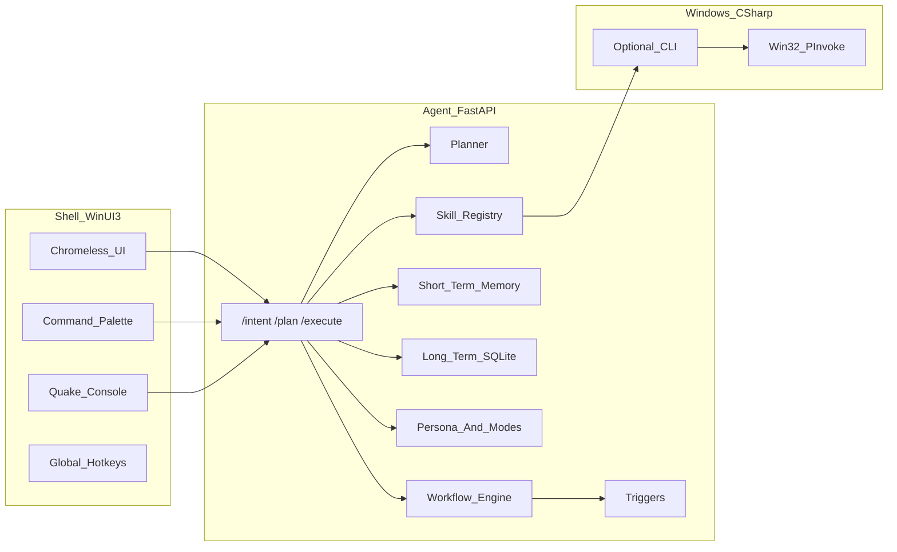

# Erica — High-Level Architecture

Technical specification for **Erica**, an AI-mediated Windows shell that can replace Explorer. This document is for developers implementing or extending the system.

## Goals

- **Shell layer**: Full-screen, minimal WinUI 3 host for command input, status, and optional voice.
- **Agent core**: Local HTTP service (FastAPI) for intent routing, planning, execution, memory, persona, and workflows.
- **Skills**: Modular capabilities declared via YAML manifests and implemented in Python (calling Win32 via a C# helper or OS APIs as needed).
- **Safety**: Least-privilege skill permissions, documented recovery for shell replacement, and clear separation between UI and privileged actions.

## System overview



## Layer responsibilities

### 1. Shell layer (WinUI 3)

| Responsibility | Notes |
|----------------|--------|
| Borderless / full-screen window | No default title bar; user-driven chrome. |
| Command palette | `Ctrl+Space`; sends text to agent (HTTP JSON). |
| Quake console | `Ctrl+``; slide-down panel; streaming output from agent. |
| Status bar | Connection state, mode hint, errors. |
| Configuration | Base URL for agent (e.g. `http://127.0.0.1:8742`). |

The shell does **not** embed the LLM; it is a thin client to the agent.

### 2. Agent core (Python, FastAPI)

| Component | Responsibility |
|-----------|----------------|
| **HTTP API** | `POST /intent`, `POST /plan`, `POST /execute`; JSON in/out. Optional SSE/streaming for console. |
| **Planner** | Maps natural language to structured plans (skill id + arguments). Rule-based initially; swappable for LLM. |
| **Skill registry** | Discovers manifests under `skills/`, validates schema, loads entrypoints, enforces `permissions`. |
| **Memory** | Short-term session state; long-term SQLite + embeddings + retrieval. |
| **Persona** | Loads `config/persona.yaml`; applies active mode (`WriterMode`, `OperatorMode`, `QuietMode`). |
| **Workflow engine** | Loads YAML from `config/workflows/`; runs steps; resolves triggers. |

### 3. Skill registry (manifest-driven)

Each skill is defined by a **YAML manifest** (see `skills/schema/`) with at least:

- `name`, `description`, `entrypoint` (Python module:function)
- `parameters` (typed schema)
- `permissions` (e.g. `process.launch`, `window.manage`, `network.wifi`, `audio.device`)
- `examples` (few-shot documentation for planner/LLM)

The agent validates manifests at startup; invalid manifests are skipped and logged.

### 4. Windows API wrapper (C#, P/Invoke)

A **class library** in `windows/` exposes:

- Window enumeration, titles, focus, minimize/maximize, placement
- Process launch (ShellExecute / CreateProcess)

**Integration pattern (v1):** a small **console or CLI** executable (optional) invoked by Python with JSON stdin/stdout, or direct `dotnet` calls—keeping the FastAPI process 64-bit and the Win32 layer in .NET. Alternative: gRPC/named pipes in a later revision.

### 5. Memory layer

| Store | Contents |
|-------|----------|
| **Short-term** | In-process: recent commands, active tasks, foreground app hints. |
| **Long-term** | SQLite: `embeddings` + `metadata` tables; insert/query/update; semantic retrieval hook (embedding model pluggable). |

**Context injection:** Each agent request can attach a synthesized context block: short-term summary + top-k long-term chunks + active persona mode.

### 6. Workflow engine (YAML)

Workflow files define:

- `id`, `name`, `steps` (ordered skill invocations or sub-workflows)
- `triggers`: `time`, `app`, `command`
- `required_skills`: declarative dependencies for validation

The engine schedules runs (APScheduler or internal timers for time triggers; polling/hooks for app triggers).

### 7. Personality layer

- **File:** `config/persona.yaml` — name, tone, modes, constraints, example responses.
- **Runtime:** Active mode affects verbosity, automation level, and confirmation requirements (e.g. `OperatorMode` may allow destructive actions with optional confirm; `QuietMode` minimizes replies).

## Security and operational risks

1. **Replacing Explorer** — If the shell executable fails at logon, the user may have no desktop. Mitigations: test in a VM; keep **restore scripts**; export registry backups; use a secondary admin account or recovery media.
2. **High-privilege skills** — Wi-Fi, audio devices, and process control must be gated by `permissions` and mode; consider explicit user confirmation for destructive operations.
3. **Cloud AI / Copilot** — API keys and prompts may contain sensitive context; document retention and use organization policy.

## Repository layout (conceptual)

```
erica/
  shell/           WinUI 3 app
  agent/           FastAPI service
  windows/         C# Win32 interop (+ optional CLI)
  skills/          Manifests + Python implementations
  memory/          Agent subpackage or data path for SQLite files
  config/          persona.yaml, workflows/
  scripts/         Registry set/restore, deployment helpers
```

## Versioning and extension

- **Planner**: Start rule-based; replace internals with LLM calls without changing shell contract if request/response models stay stable.
- **Skills**: Add new YAML + Python modules; no agent core change beyond registry scan path.
- **Windows layer**: Extend P/Invoke surface in C#; expose new operations through skills, not by shell changes.
